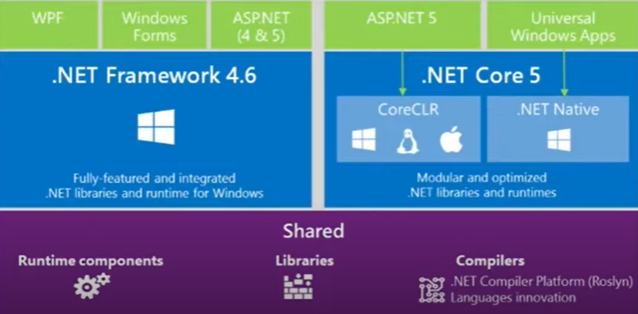
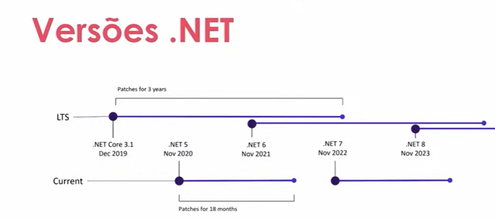
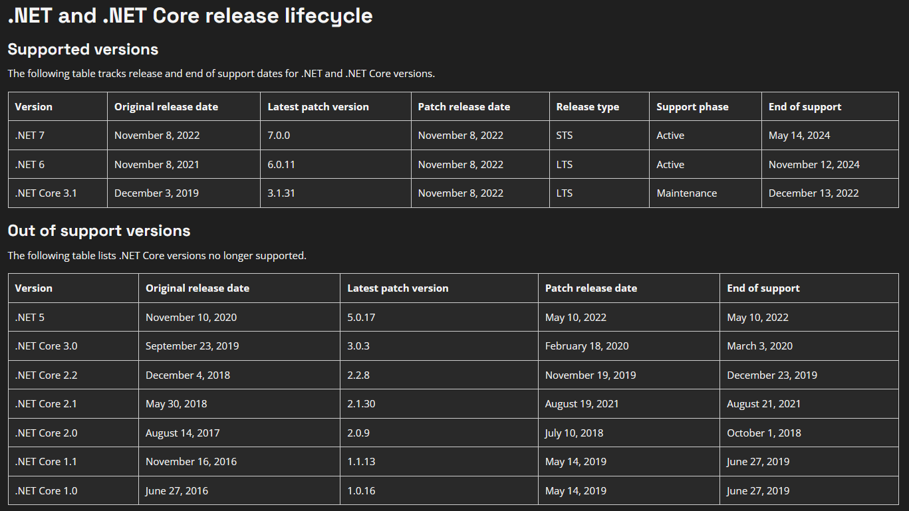

# CSharpOO

## .NET Core 5 em diante é multiplataforma
Fazer uso do CoreCLR ao criar a aplicação

Evolução de Core para somente .NET

Ciclo de Suporte e Atualizações referente a Linguagem Patches 

